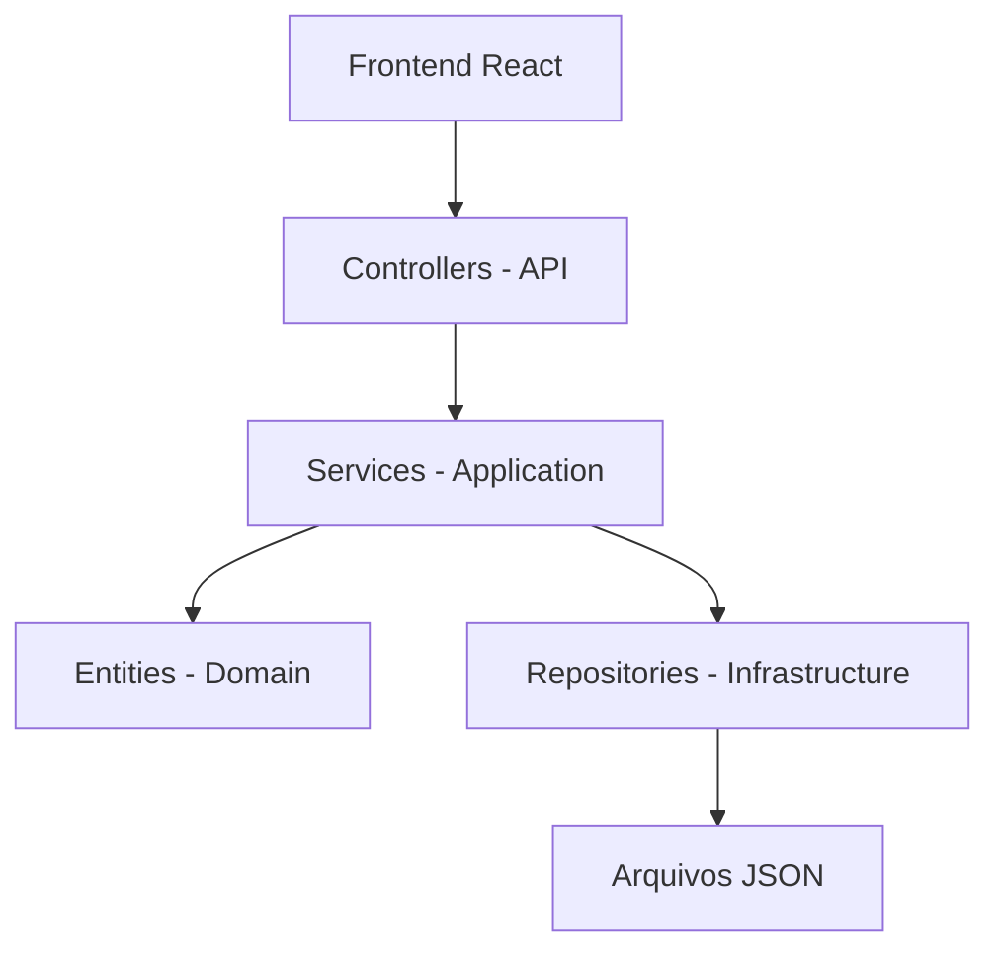
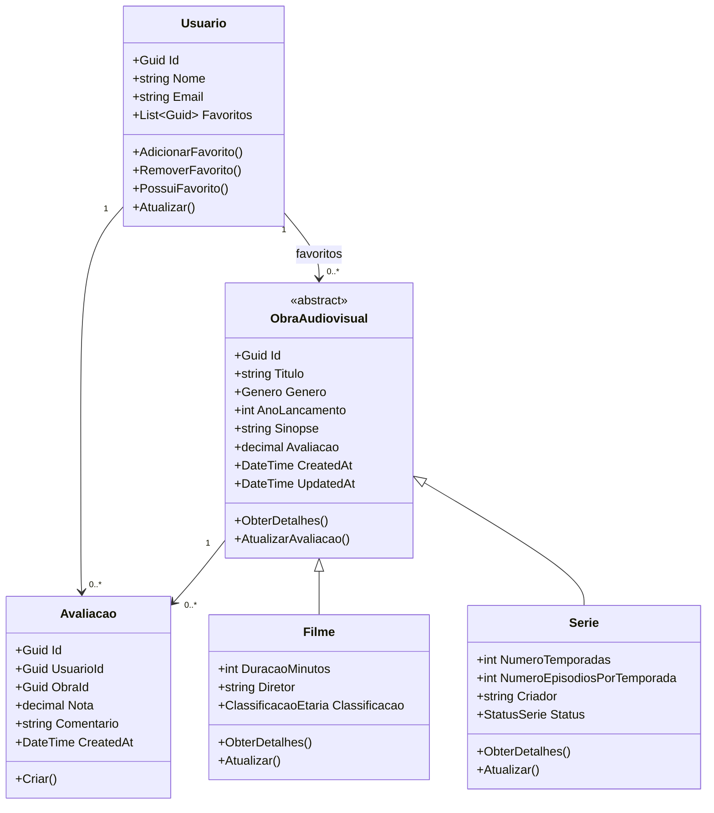
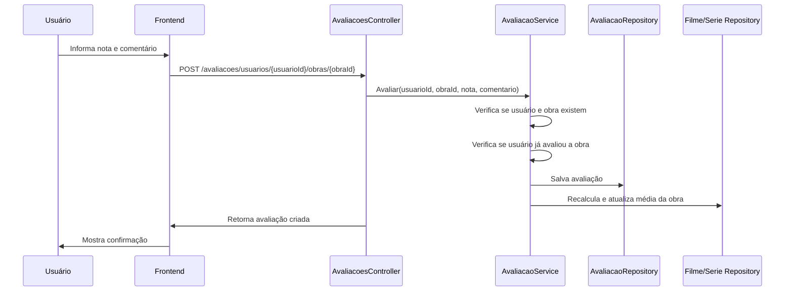
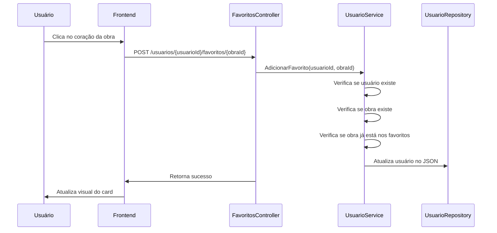

# Documentação do Projeto — CineLog

## 1. Introdução

O **CineLog** é um sistema de catálogo de filmes e séries desenvolvido em **C#** para a disciplina de **Programação Orientada por Objetos**.

O objetivo do projeto é permitir o gerenciamento de obras audiovisuais, possibilitando o cadastro de filmes, séries e usuários, além de funcionalidades como favoritos e avaliações. O sistema foi construído com foco na aplicação dos quatro pilares da Programação Orientada por Objetos: **abstração, encapsulamento, herança e polimorfismo**.

Além da estrutura orientada a objetos, o projeto também possui uma API em ASP.NET Core, interface web em React e persistência de dados em arquivos JSON.

---

## 2. Descrição do Projeto

O sistema permite que usuários organizem um catálogo pessoal de filmes e séries. Cada obra audiovisual possui informações como título, gênero, ano de lançamento, sinopse e avaliação média.

As obras podem ser classificadas como **Filme** ou **Série**, cada uma com características próprias. Filmes possuem duração, diretor e classificação etária. Séries possuem número de temporadas, episódios por temporada, criador e status.

O usuário pode:

* cadastrar filmes;
* cadastrar séries;
* cadastrar usuários;
* consultar o catálogo completo;
* buscar obras por título;
* filtrar obras por tipo e gênero;
* selecionar um usuário ativo;
* adicionar obras aos favoritos;
* remover obras dos favoritos;
* avaliar obras com nota e comentário;
* visualizar a média das avaliações.

O sistema também impede que o mesmo usuário avalie a mesma obra mais de uma vez, garantindo uma regra de negócio importante para a consistência das avaliações.

---

## 3. Funcionalidades Implementadas

### 3.1 Cadastro de Filmes

O sistema permite cadastrar filmes com os seguintes dados:

* título;
* gênero;
* ano de lançamento;
* sinopse;
* avaliação;
* duração em minutos;
* diretor;
* classificação etária.

Também é possível listar, editar e excluir filmes cadastrados.

---

### 3.2 Cadastro de Séries

O sistema permite cadastrar séries com os seguintes dados:

* título;
* gênero;
* ano de lançamento;
* sinopse;
* avaliação;
* número de temporadas;
* número de episódios por temporada;
* criador;
* status da série.

Também é possível listar, editar e excluir séries cadastradas.

---

### 3.3 Cadastro de Usuários

O sistema permite cadastrar usuários com nome e e-mail.

Cada usuário possui sua própria lista de favoritos e suas próprias avaliações. O sistema impede o cadastro de e-mails duplicados.

---

### 3.4 Favoritos

O usuário ativo pode adicionar filmes ou séries aos favoritos.

Cada usuário possui uma lista individual de favoritos, e o sistema impede que a mesma obra seja adicionada mais de uma vez aos favoritos do mesmo usuário.

Também é possível remover obras da lista de favoritos.

---

### 3.5 Avaliações

O sistema permite que usuários avaliem obras com:

* nota de 0 a 10;
* comentário opcional.

Após uma nova avaliação, a média da obra é recalculada automaticamente.

Regra de negócio aplicada:

* um usuário não pode avaliar a mesma obra mais de uma vez.

---

### 3.6 Busca e Filtros

O catálogo permite:

* busca por título;
* filtro por tipo, filme ou série;
* filtro por gênero.

Essas funcionalidades facilitam a navegação do usuário pelo catálogo.

---

## 4. Arquitetura do Sistema

O projeto foi organizado em camadas, separando responsabilidades e facilitando manutenção.

A estrutura principal do backend é composta por:

```text
Api
Application
Domain
Infrastructure
```

### 4.1 Camada Api

A camada **Api** contém os controllers, DTOs e middleware de exceções.

Responsabilidades:

* receber requisições HTTP;
* validar dados recebidos;
* encaminhar chamadas para os serviços;
* retornar respostas padronizadas;
* tratar erros por meio de middleware global.

Exemplos:

* `FilmesController`;
* `SeriesController`;
* `UsuariosController`;
* `CatalogoController`;
* `FavoritosController`;
* `AvaliacoesController`.

---

### 4.2 Camada Application

A camada **Application** contém os services e interfaces responsáveis pelas regras de negócio.

Responsabilidades:

* criar, atualizar, listar e remover entidades;
* aplicar regras de negócio;
* validar conflitos;
* coordenar repositórios;
* recalcular média de avaliações.

Exemplos:

* `FilmeService`;
* `SerieService`;
* `UsuarioService`;
* `CatalogoService`;
* `AvaliacaoService`.

---

### 4.3 Camada Domain

A camada **Domain** contém as entidades principais, enums e exceções de domínio.

Responsabilidades:

* representar as regras centrais do sistema;
* proteger os dados das entidades;
* concentrar comportamentos relacionados ao domínio.

Exemplos:

* `ObraAudiovisual`;
* `Filme`;
* `Serie`;
* `Usuario`;
* `Avaliacao`;
* `DomainException`;
* `ConflictException`;
* `NotFoundException`.

---

### 4.4 Camada Infrastructure

A camada **Infrastructure** contém os repositórios e a lógica de persistência em arquivos JSON.

Responsabilidades:

* salvar dados;
* carregar dados;
* isolar o armazenamento das demais camadas.

Exemplos:

* `FilmeRepository`;
* `SerieRepository`;
* `UsuarioRepository`;
* `AvaliacaoRepository`.

---

## 5. Diagrama Simplificado da Arquitetura



O frontend se comunica com a API por meio de requisições HTTP. Os controllers recebem as requisições e acionam os services. Os services aplicam as regras de negócio e utilizam os repositories para persistir os dados em arquivos JSON.

---

## 6. Diagrama de Classes



---

## 7. Aplicação dos Quatro Pilares da POO

## 7.1 Abstração

A abstração aparece principalmente na classe `ObraAudiovisual`.

Ela representa características comuns a filmes e séries, como:

* título;
* gênero;
* ano de lançamento;
* sinopse;
* avaliação;
* data de criação;
* data de atualização.

Essa classe serve como uma base genérica para os tipos específicos de obra.

Com isso, o sistema não precisa repetir os mesmos atributos em `Filme` e `Serie`.

---

## 7.2 Encapsulamento

O encapsulamento aparece na forma como as entidades protegem seus dados.

As propriedades das entidades possuem alteração controlada, geralmente com `private set`. Isso impede que outras partes do sistema alterem os dados diretamente sem passar pelas regras da classe.

Exemplos de métodos que controlam alterações:

* `AdicionarFavorito`;
* `RemoverFavorito`;
* `Atualizar`;
* `AtualizarAvaliacao`.

Isso garante que as regras de negócio fiquem dentro das próprias entidades e serviços, reduzindo inconsistências.

---

## 7.3 Herança

A herança aparece na relação entre `ObraAudiovisual`, `Filme` e `Serie`.

A classe `ObraAudiovisual` é a classe base. As classes `Filme` e `Serie` herdam suas propriedades e comportamentos comuns.

Estrutura:

```text
ObraAudiovisual
├── Filme
└── Serie
```

Essa herança permite reutilização de código e deixa o sistema mais organizado.

---

## 7.4 Polimorfismo

O polimorfismo aparece no método `ObterDetalhes()`.

A classe `ObraAudiovisual` define esse método de forma abstrata. Cada classe filha implementa sua própria versão.

Exemplos:

* `Filme.ObterDetalhes()` retorna detalhes como diretor, duração e classificação;
* `Serie.ObterDetalhes()` retorna detalhes como criador, temporadas e status.

Assim, o sistema pode tratar filmes e séries como obras audiovisuais, mas cada tipo responde de forma diferente ao mesmo método.

---

## 8. Persistência em JSON

O sistema utiliza arquivos JSON para armazenar os dados.

Os arquivos ficam na pasta:

```text
src/catalogo-api/Data
```

Arquivos utilizados:

```text
filmes.json
series.json
usuarios.json
avaliacoes.json
```

Cada repositório é responsável por carregar e salvar os dados de uma entidade específica.

Exemplos:

* `FilmeRepository` salva e carrega filmes;
* `SerieRepository` salva e carrega séries;
* `UsuarioRepository` salva e carrega usuários;
* `AvaliacaoRepository` salva e carrega avaliações.

Quando a API é iniciada, os repositórios carregam os dados existentes. Quando uma entidade é cadastrada, alterada ou removida, o respectivo arquivo JSON é atualizado.

Isso permite que os dados continuem disponíveis mesmo após fechar e abrir o sistema novamente.

---

## 9. Validações e Tratamento de Exceções

O sistema possui validações tanto nos DTOs quanto nas entidades de domínio.

Exemplos de validações:

* título obrigatório;
* título com tamanho máximo;
* ano de lançamento válido;
* avaliação entre 0 e 10;
* duração do filme maior que zero;
* número de temporadas maior que zero;
* número de episódios maior que zero;
* nome de usuário obrigatório;
* e-mail válido;
* comentário com limite de caracteres;
* bloqueio de favorito duplicado;
* bloqueio de avaliação duplicada.

O tratamento de erros é centralizado no `GlobalExceptionMiddleware`.

Esse middleware captura exceções e retorna respostas padronizadas para a API.

Principais tipos de erro:

* `NotFoundException`: recurso não encontrado;
* `ConflictException`: conflito de regra de negócio;
* `DomainException`: erro de validação do domínio;
* `Exception`: erro interno inesperado.

---

## 10. Padrões de Projeto e Boas Práticas

## 10.1 Repository Pattern

O projeto utiliza repositórios para isolar a persistência de dados.

Os services não precisam saber como os dados são armazenados. Eles apenas chamam métodos como:

* `GetAll`;
* `GetById`;
* `Add`;
* `Update`;
* `Remove`.

Isso facilita uma futura troca de persistência, por exemplo, de JSON para banco de dados.

---

## 10.2 Service Layer

A camada de services concentra as regras de negócio.

Exemplos:

* impedir e-mail duplicado;
* impedir favorito duplicado;
* impedir avaliação duplicada;
* recalcular média da obra;
* validar existência de usuários e obras.

Essa separação evita que os controllers fiquem com regras de negócio misturadas com código de requisição HTTP.

---

## 10.3 DTOs

O projeto utiliza DTOs para separar os dados da API das entidades de domínio.

Isso evita expor diretamente as entidades internas e permite controlar melhor os dados enviados e recebidos.

Exemplos:

* `CriarFilmeRequest`;
* `CriarSerieRequest`;
* `CriarUsuarioRequest`;
* `CriarAvaliacaoRequest`;
* `FilmeResponse`;
* `SerieResponse`;
* `AvaliacaoResponse`.

---

## 10.4 Middleware de Exceções

O middleware global centraliza o tratamento de erros.

Com isso, os controllers ficam mais limpos, e as respostas de erro ficam padronizadas.

---

## 10.5 Injeção de Dependência

O projeto utiliza injeção de dependência no `Program.cs`.

Services e repositories são registrados e depois injetados automaticamente onde são necessários.

Isso reduz o acoplamento entre classes e facilita manutenção.

---

## 11. Fluxo de Avaliação



---

## 12. Fluxo de Favoritos



---

## 13. Interface Web

O frontend foi desenvolvido com React, TypeScript e Vite.

Principais telas:

* Catálogo;
* Favoritos;
* Admin;
* Detalhes de Filme;
* Detalhes de Série.

A tela de catálogo permite buscar, filtrar, favoritar e avaliar obras.

A tela de favoritos mostra as obras favoritas do usuário ativo.

A tela administrativa permite cadastrar e gerenciar filmes, séries e usuários.

---

## 14. Como Executar

### Backend

Acesse a pasta da API:

```powershell
cd src/catalogo-api
```

Restaure as dependências:

```powershell
dotnet restore
```

Compile:

```powershell
dotnet build
```

Execute:

```powershell
dotnet run
```

A API será executada em:

```text
http://localhost:5136
```

Swagger:

```text
http://localhost:5136/swagger
```

---

### Frontend

Em outro terminal, acesse a pasta do frontend:

```powershell
cd frontend
```

Instale as dependências:

```powershell
npm install
```

Execute:

```powershell
npm run dev
```

O frontend será executado em:

```text
http://localhost:5173
```

---

## 15. Testes Realizados

Foram realizados testes manuais para verificar:

* cadastro de filmes;
* cadastro de séries;
* cadastro de usuários;
* listagem do catálogo;
* filtro por tipo;
* filtro por gênero;
* busca por título;
* adição de favoritos;
* remoção de favoritos;
* persistência dos favoritos em JSON;
* criação de avaliações;
* bloqueio de avaliação duplicada;
* atualização da média após avaliação;
* persistência das avaliações em JSON;
* carregamento dos dados após reiniciar a API.

---

## 16. Possíveis Melhorias Futuras

Algumas melhorias que podem ser implementadas futuramente:

* autenticação com login e senha;
* banco de dados relacional ou não relacional;
* listas adicionais, como “Quero assistir” e “Assistidos”;
* recomendações automáticas;
* upload de imagem/poster;
* paginação no catálogo;
* relatórios de obras mais bem avaliadas;
* testes automatizados.

---

## 17. Conclusão

O CineLog atende ao objetivo de criar um sistema orientado a objetos em C# baseado em um problema real.

O projeto aplica os quatro pilares da Programação Orientada por Objetos, utiliza separação em camadas, persistência em JSON, tratamento de exceções e interface web.

As funcionalidades de favoritos e avaliações tornam o sistema mais completo e alinhado ao tema de catálogo de filmes e séries, permitindo que cada usuário organize e avalie suas obras de forma individual.
